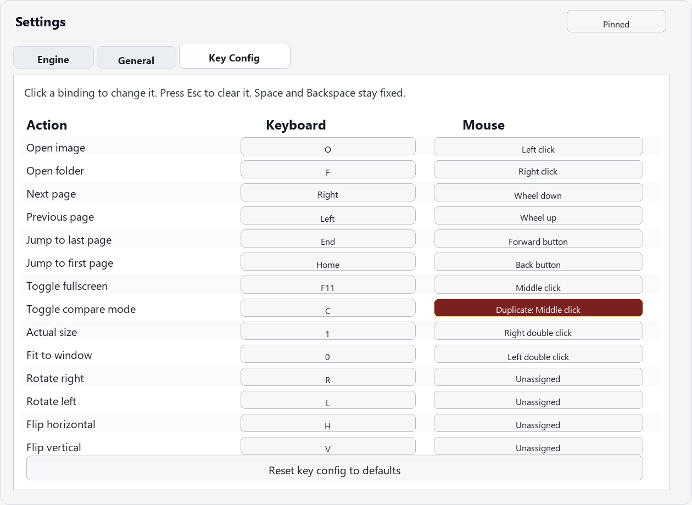
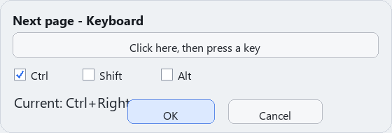
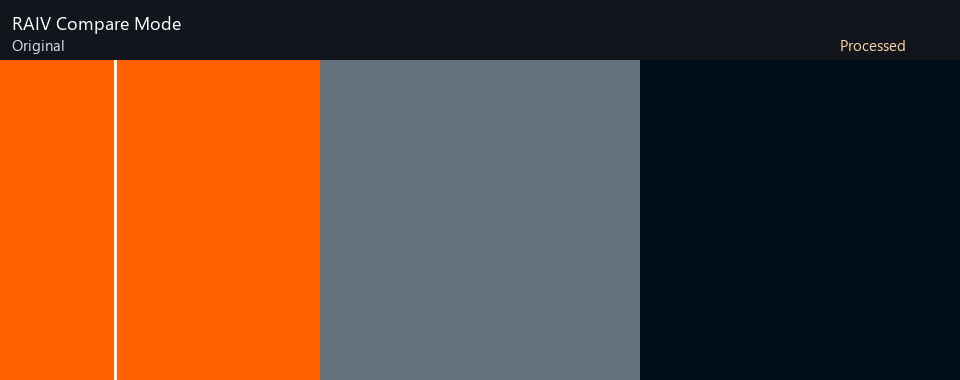

# Realtime AI Image Viewer (RAIV)

RAIV は、Real-CUGAN / Real-ESRGAN による画像の超解像・復元処理を自動で行いながら閲覧できる Windows 向け画像ビューアーです。画像を開くだけで処理済み画像を表示し、処理前後の比較、ページ送り、ズーム、パン、サムネイル移動などを行えます。高速なページ送りと先読みを重視しており、大量の画像を快適に閲覧することを目指しています。`RAIV` の開発は Codex を用いた完全AIコーディングで行われています。

English version is below the Japanese section.

## 初回セットアップ

Python をインストールしたあと、最初に次を実行してください。

```powershell
install_support.bat
```

この bat は以下の Python パッケージを導入します。

- `PySide6`: アプリ画面
- `Pillow`: 高品質な表示サイズ変換
- `opencv-python-headless`: Lanczos4 用の任意パッケージ
- `py7zr`: 7z/CB7 アーカイブ対応
- `rarfile`: RAR/CBR アーカイブ対応の補助

RAR/CBR は環境によって、別途 7-Zip、UnRAR、bsdtar のいずれかが必要です。

## 開発者向けセットアップ

開発・テスト時は次の手順を使います。

```powershell
python -m pip install -r requirements-dev.txt
pytest
```

主要ファイル:

- `requirements.txt`: 実行依存
- `requirements-dev.txt`: 開発依存（pytestを含む）
- `pytest.ini`: テスト設定
- `docs/BACKLOG.md`: 実装バックログ（100項目）
- `pyproject.toml`: Ruff / mypy の設定
- `.pre-commit-config.yaml`: pre-commit フック設定
- `.github/workflows/`: CI / 品質 / セキュリティ監査 / 配布パッケージ

## 既知の制約

- Windows 向けアプリです。
- Real-CUGAN / Real-ESRGAN は外部実行ファイルのため、GPUやドライバ環境に依存します。
- Real-ESRGAN 選択時の倍率は RAIV 側では 4 倍固定です。
- RAR/CBR は環境によって外部展開ツール（7z/UnRAR/bsdtar）が必要です。

## トラブルシュート

- 起動できない: `install_support.bat` を再実行し、PySide6 が導入されているか確認。
- 7z/RAR が開けない: `py7zr` / `rarfile` の導入状況と 7z/UnRAR の存在を確認。
- 処理が失敗する: エンジン設定の `コマンドテンプレート` と exe パスを確認。
- 描画品質が想定と違う: OpenCV 未導入時は Lanczos4 が Lanczos3 相当にフォールバックします。

## リリース手順

`docs/RELEASE_CHECKLIST.md` を参照してください。

## セットアップ失敗FAQ

- `PySide6 が見つかりません` と表示される: `install_support.bat` を再実行してから起動してください。
- `7z/rar を開けない`: `py7zr` / `rarfile` と、必要なら 7-Zip / UnRAR / bsdtar の導入を確認してください。
- `エンジン実行に失敗する`: エンジン設定の exe パスとコマンドテンプレートを確認してください。

## 同梱ライセンスチェック

配布前に `docs/RELEASE_CHECKLIST.md` の Packaging セクションを使い、`tools` 配下の LICENSE/README/モデル同梱漏れがないことを確認してください。

## 起動

通常は `RAIV.exe` を実行します。開発中にPythonから起動する場合は次のコマンドを使用します。

```powershell
python .\raiv.py
```

Windows の既定アプリとして使いたい場合:

```powershell
powershell -ExecutionPolicy Bypass -File .\register_raiv_file_association.ps1
```

このスクリプトは、対応拡張子を RAIV に関連付けし、既定のアプリ設定画面を開きます。
Windows では拡張子ごとの既定アプリ確定に 1 回の確認が必要な場合があります。

通常の Windows 実行形式（.exe）にしたい場合:

```powershell
build_raiv_exe.bat
```

ビルド後は `dist\RAIV\RAIV.exe` が生成されます。
このフォルダ内で次を実行すると、`.exe` を既定アプリ候補として登録できます。

```powershell
powershell -ExecutionPolicy Bypass -File .\register_raiv_file_association.ps1
```

起動時オプション:

```powershell
python .\raiv.py <path>
python .\raiv.py <path> --lang en
```

ログは右ペインの全般タブにある `ログを表示` でオン/オフできます。

## 画像を開く

- 画像ファイル、フォルダ、ZIP/CBZ、RAR/CBR、7z/CB7 をドラッグアンドドロップ
- `O` キーで画像ファイルを選択
- `F` キーでフォルダを選択

画像ファイルを開いた場合は、まずその画像を表示し、同じフォルダ内の画像一覧はあとから取得します。

## 画像処理エンジン

右ペインのエンジン設定タブで、Real-CUGAN と Real-ESRGAN を切り替えられます。

Real-CUGAN:

```text
tools\realcugan-ncnn-vulkan\realcugan-ncnn-vulkan.exe
```

Real-ESRGAN:

```text
tools\realesrgan-ncnn-vulkan\realesrgan-ncnn-vulkan.exe
```

Real-ESRGAN は x4 モデルのため、RAIV では Real-ESRGAN 選択中の倍率を 4 倍固定として扱います。倍率欄は無効化されますが、Real-CUGAN に戻した時の値は保持されます。

Real-ESRGAN モデル:

- `realesr-animevideov3`: アニメ/イラスト向けの軽量モデル
- `realesrgan-x4plus`: 写真や一般画像向け
- `realesrgan-x4plus-anime`: アニメ/イラスト向けの x4plus 系モデル

## 主な設定

エンジン設定:

- 倍率、ノイズ、tile
- エンジン先読み枚数
- 指定縦解像度以上の画像を拡大処理しない設定
- 拡大結果を倍率フォルダへ保存
- 倍率フォルダがあれば表示に使う

全般:

- Language（日本語 / English）
- ビューアー先読み枚数
- CPU リサンプルキャッシュ
- 表示リサンプル方式: Lanczos3、Lanczos4、Bicubic、Area
- 背景色
- 比較モード、比較スライダー、境界線色、境界線太さ
- 表示リセット、ページ送り間隔
- 現在ページ位置の表示とスライダー移動
- ページ位置スライダーとサムネイル列の左右入れ替え
- 画面下部サムネイルの表示と固定/自動表示
- 最後/最初でページ送りした時のループ
- ページ送り時にズーム、表示位置、回転/反転状態を維持
- マウス横スクロールのページ送り有効化と方向反転
- 全画面時のマウスカーソル非表示
- ログ表示
- 内部プロファイリング表示
- 次回起動時の古い一時ファイル削除

サムネイル列は下端に表示されます。固定表示では画像表示領域を少し使い、自動表示ではビューアー下端へマウスを近づけた時だけ重ねて表示します。サムネイルの大きさは列の高さ変更に合わせて自動調整されます。

キーコンフィグ:

- 各機能につき、キーボード1つ、マウスボタン1つを割り当て可能
- 設定値をクリックしてからキーまたはマウスボタンを押すと割当を変更
- `Ctrl`、`Shift`、`Alt` との組み合わせ指定に対応
- 設定中に `Esc` を押すと未割当に戻る
- `Space` の次ページ送り、`Backspace` の前ページ送りは固定

キーコンフィグ画面:





CPU リサンプルキャッシュをオンにすると、原寸と異なる表示サイズの画像を高品質に作成して保持します。ズーム操作中は速度を優先し、操作が止まってから高品質表示へ切り替わります。オフにすると標準の高速表示になります。

## 操作

マウス:

- ホイール: 前後ページ送り
- 横スクロール: 設定で有効にした場合のみ前後ページ送り
- `Ctrl` + ホイール: ズーム
- `Ctrl` + 左ドラッグ上下: 上でズームイン、下でズームアウト
- 左ドラッグ: パン
- 比較モード中のドラッグ: 比較境界線の移動
- 比較モード中の `Shift` + ドラッグ: 設定に応じてパン/境界線移動を切り替え
- ホイールクリック: ボーダーレス全画面の切り替え（キーコンフィグで変更可能）
- 左ダブルクリック: 表示を中央へリセット（キーコンフィグで変更可能）
- 右ダブルクリック: 等倍表示（キーコンフィグで変更可能）
- 戻る/進むボタン: フォルダ内の先頭/末尾へ移動（キーコンフィグで変更可能）

キーボード:

- `O`: 画像を開く（キーコンフィグで変更可能）
- `F`: フォルダを開く（キーコンフィグで変更可能）
- 左カーソル: 次ページへ移動（キーコンフィグで変更可能）
- 右カーソル: 前ページへ移動（キーコンフィグで変更可能）
- `F3`: サムネイル列の固定/自動表示を切り替え（キーコンフィグで変更可能）
- `F4`: 右ペインの固定/自動表示を切り替え（キーコンフィグで変更可能）
- `R`: 画像を右回転（キーコンフィグで変更可能）
- `L`: 画像を左回転（キーコンフィグで変更可能）
- `H`: 画像を左右反転（キーコンフィグで変更可能）
- `V`: 画像を上下反転（キーコンフィグで変更可能）
- `Space`: 次ページへ移動
- `Backspace`: 前ページへ移動

比較モードイメージ:



## 保存フォルダ

拡大結果の保存を有効にすると、元画像と同じフォルダ配下にエンジン/倍率に応じたサブフォルダを作成します。

例:

- `realcugan_x2`
- `realesrgan_realesrgan-x4plus_x4`

アーカイブ表示中は保存先フォルダがないため、倍率フォルダ保存と倍率フォルダ読み込みは無効になります。

## 設定と一時ファイル

設定はアプリと同じフォルダの `setting.json` に保存されます。設定ファイルがない場合は初期設定で起動します。

一時ファイルは OS の一時フォルダに RAIV 用の接頭辞付きで作成され、通常終了時に削除されます。クラッシュなどで残った場合に備えて、全般タブから次回起動時の古い一時ファイル削除を予約できます。

## アーカイブ対応

ZIP/CBZ は標準ライブラリで展開します。7z/CB7 は `py7zr` または外部 7-Zip を使います。RAR/CBR は `rarfile`、または外部の 7z/7za/7zr、UnRAR、bsdtar を使います。

## ライセンスと同梱物

RAIV 本体は MIT License です。詳細は `LICENSE` を参照してください。

同梱している外部ツール:

- Real-CUGAN ncnn Vulkan: MIT License  
  付属ファイル: `tools\realcugan-ncnn-vulkan\LICENSE`, `tools\realcugan-ncnn-vulkan\README.md`
- Real-ESRGAN ncnn Vulkan / Real-ESRGAN: BSD 3-Clause License  
  付属ファイル: `tools\realesrgan-ncnn-vulkan\LICENSE`, `tools\realesrgan-ncnn-vulkan\README_windows.md`

配布時は `tools` 配下の exe、DLL、モデル、README、LICENSE を欠落させないようにしてください。

---

# Realtime AI Image Viewer (RAIV)

RAIV is a Windows image viewer that automatically displays images processed with Real-CUGAN or Real-ESRGAN super-resolution/restoration. Open an image and RAIV can show the processed result, compare before/after images, browse pages, zoom, pan, and navigate with thumbnails. RAIV focuses on fast page navigation and prefetching so large image folders can be browsed comfortably. Development of `RAIV` is done through fully AI-assisted coding with Codex.

## First Setup

After installing Python, run:

```powershell
install_support.bat
```

This batch file installs the following Python packages:

- `PySide6`: application UI
- `Pillow`: high-quality display resizing
- `opencv-python-headless`: optional package for Lanczos4
- `py7zr`: 7z/CB7 archive support
- `rarfile`: helper package for RAR/CBR archive support

Depending on your environment, RAR/CBR support may also require 7-Zip, UnRAR, or bsdtar.

## Developer Setup

For development and tests:

```powershell
python -m pip install -r requirements-dev.txt
pytest
```

Key files:

- `requirements.txt`: runtime dependencies
- `requirements-dev.txt`: development dependencies (includes pytest)
- `pytest.ini`: test settings
- `docs/BACKLOG.md`: implementation backlog (100 items)
- `pyproject.toml`: Ruff / mypy settings
- `.pre-commit-config.yaml`: pre-commit hooks
- `.github/workflows/`: CI / quality / security audit / packaging automation

## Known Constraints

- RAIV targets Windows.
- Real-CUGAN / Real-ESRGAN are external executables and depend on GPU/driver environment.
- While Real-ESRGAN is selected, RAIV treats scale as fixed 4x.
- RAR/CBR may require external extraction tools (7z/UnRAR/bsdtar).

## Troubleshooting

- App does not start: run `install_support.bat` again and verify PySide6 is installed.
- 7z/RAR cannot be opened: check `py7zr` / `rarfile` and external 7z/UnRAR availability.
- Processing fails: verify engine command template and executable path in settings.
- Unexpected resampling quality: without OpenCV, Lanczos4 falls back to Lanczos3-equivalent behavior.

## Release Procedure

See `docs/RELEASE_CHECKLIST.md`.

## Setup Failure FAQ

- `PySide6 not found`: run `install_support.bat` again and relaunch.
- Archive open failure: verify `py7zr` / `rarfile` and external 7-Zip / UnRAR / bsdtar when needed.
- Engine execution failure: verify executable path and command template in engine settings.

## Bundled License Checklist

Before distribution, use the Packaging section in `docs/RELEASE_CHECKLIST.md` to confirm LICENSE/README/model files under `tools` are fully included.

## Launch

Usually, launch `RAIV.exe`. For development, you can still run from Python:

```powershell
python .\raiv.py
```

If you want a normal Windows executable (.exe):

```powershell
build_raiv_exe.bat
```

After build, `dist\RAIV\RAIV.exe` is created.
Run the following command in `dist\RAIV` to register the built exe as an app choice for supported file extensions.

```powershell
powershell -ExecutionPolicy Bypass -File .\register_raiv_file_association.ps1
```

Startup options:

```powershell
python .\raiv.py <path>
python .\raiv.py <path> --lang en
```

Logs can be shown or hidden from `Show log` in the General tab.

## Opening Images

- Drag and drop an image file, folder, ZIP/CBZ, RAR/CBR, or 7z/CB7 archive
- Press `O` to select an image file
- Press `F` to select a folder

When an image file is opened, RAIV displays it first and then collects the rest of the images in the same folder.

## Processing Engines

Use the Engine Settings tab in the right panel to switch between Real-CUGAN and Real-ESRGAN.

Real-CUGAN:

```text
tools\realcugan-ncnn-vulkan\realcugan-ncnn-vulkan.exe
```

Real-ESRGAN:

```text
tools\realesrgan-ncnn-vulkan\realesrgan-ncnn-vulkan.exe
```

Real-ESRGAN uses x4 models, so RAIV treats the scale as fixed to 4x while Real-ESRGAN is selected. The scale field is disabled in that mode, but the Real-CUGAN scale value is preserved.

Real-ESRGAN models:

- `realesr-animevideov3`: lightweight model for anime/illustration images
- `realesrgan-x4plus`: model for photos and general images
- `realesrgan-x4plus-anime`: x4plus-style model for anime/illustration images

## Main Settings

Engine settings:

- Scale, denoise, tile
- Engine prefetch count
- Skip processing for images above a specified vertical resolution
- Save processed images to a scale folder
- Use an existing scale folder as display cache

General:

- Language (Japanese / English)
- Viewer prefetch count
- CPU resample cache
- Display resampling method: Lanczos3, Lanczos4, Bicubic, Area
- Background color
- Compare mode, compare slider, divider color, divider width
- Reset view, page navigation interval
- Current page slider and page count
- Reverse page slider direction and thumbnail strip direction
- Bottom thumbnail strip with pinned/auto display modes
- Wrap around at first/last page
- Preserve zoom, pan, rotation, and flip state during page navigation
- Horizontal mouse wheel page navigation and direction reverse
- Hide mouse cursor in fullscreen
- Log display
- Internal profiling display
- Cleanup old temporary files on next startup

The thumbnail strip appears at the bottom. In pinned mode it uses part of the image area; in auto mode it overlays the viewer only when the mouse approaches the bottom edge. Thumbnail size is adjusted automatically from the strip height.

Key configuration:

- One keyboard binding and one mouse binding can be assigned to each action
- Click a binding value, then press a key or mouse button to change it
- `Ctrl`, `Shift`, and `Alt` modifiers are supported
- Press `Esc` while assigning to clear a binding
- `Space` for next page and `Backspace` for previous page are fixed

Key configuration screens:


When CPU resample cache is enabled, RAIV creates and keeps high-quality display-size images. During zoom interaction it prioritizes speed, then switches to high-quality rendering after the operation stops. When disabled, RAIV uses the standard fast display path.

## Controls

Mouse:

- Wheel: previous/next page
- Horizontal wheel: previous/next page only when enabled
- `Ctrl` + wheel: zoom
- `Ctrl` + left-drag up/down: zoom in/out
- Left-drag: pan
- Drag in compare mode: move compare divider
- `Shift` + drag in compare mode: switch pan/divider behavior depending on the setting
- Middle click: toggle borderless fullscreen, configurable
- Left double click: reset view to center, configurable
- Right double click: actual-size view, configurable
- Back/Forward mouse buttons: jump to first/last image in the folder, configurable

Keyboard:

- `O`: open image, configurable
- `F`: open folder, configurable
- Left arrow: next page, configurable
- Right arrow: previous page, configurable
- `F3`: toggle thumbnail strip pinned/auto mode, configurable
- `F4`: toggle right panel pinned/auto mode, configurable
- `R`: rotate image right, configurable
- `L`: rotate image left, configurable
- `H`: flip image horizontally, configurable
- `V`: flip image vertically, configurable
- `Space`: next page
- `Backspace`: previous page

Compare mode preview:


## Save Folders

When saving processed results is enabled, RAIV creates an engine/scale-specific subfolder next to the original image.

Examples:

- `realcugan_x2`
- `realesrgan_realesrgan-x4plus_x4`

While viewing archives, scale-folder saving and scale-folder cache loading are disabled because there is no normal output folder.

## Settings and Temporary Files

Settings are saved as `setting.json` in the application folder. If the file does not exist, RAIV starts with default settings.

Temporary files are created under the OS temporary folder with RAIV-specific prefixes and are removed on normal exit. If files remain after a crash, you can reserve cleanup of old temporary files from the General tab for the next startup.

## Archive Support

ZIP/CBZ is handled by the Python standard library. 7z/CB7 uses `py7zr` or external 7-Zip. RAR/CBR uses `rarfile`, or external 7z/7za/7zr, UnRAR, or bsdtar.

## License and Bundled Components

RAIV itself is released under the MIT License. See `LICENSE` for details.

Bundled external tools:

- Real-CUGAN ncnn Vulkan: MIT License  
  Included files: `tools\realcugan-ncnn-vulkan\LICENSE`, `tools\realcugan-ncnn-vulkan\README.md`
- Real-ESRGAN ncnn Vulkan / Real-ESRGAN: BSD 3-Clause License  
  Included files: `tools\realesrgan-ncnn-vulkan\LICENSE`, `tools\realesrgan-ncnn-vulkan\README_windows.md`

When redistributing RAIV, keep the exe, DLL, model, README, and LICENSE files under `tools` intact.


